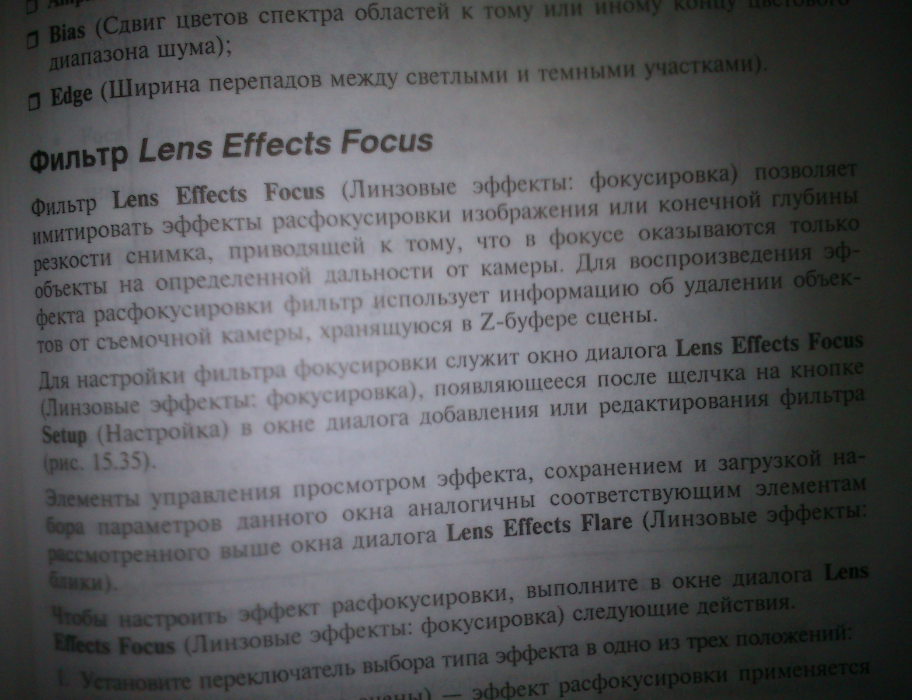

<h3 align="center">Enhancer for Scanned Images</h3>
  <p align="center">
    Algorithm Engineering <br />
    Friedrich Schiller University Jena <br />
    <a href="https://github.com/Kr3b5/fsu-algoeng/issues">Report Bug</a>
  </p>

## About The Project

Free tool (executable) for improving the quality of scanned documents before printing (or sending) them.

* **Input**: portable pix map (ppm) color image(s) in ASCII-format (P3)
  * Tool to convert image to P3 ppm image: [IrfanView](https://www.irfanview.com/) 
    * :warning: IrfanView writes a comment in the image which must be deleted with a texteditor:
    ```
    P3
    # Created by IrfanView   <-- delete this line and save file 
    1440 809
    ``` 
* **Output**: cleaned ppm image(s) in ASCII-format

### Built With

* C++
* [CMake](https://cmake.org/)

#### :books: Libraries 

* [OpenMP](https://www.openmp.org/)
* [Catch2](https://github.com/catchorg/Catch2)

## Getting Started (Linux)

### :hammer: Build project

To compile the project a c++ compiler and cmake is needed. If it is missing execute the following commands:   

```
sudo apt update 
sudo apt install cmake 
sudo apt install gcc  
```

Next, the project must be copied locally:

```
git clone https://github.com/Kr3b5/fsu-algoeng.git
```

Now you can go into the `project` directory and start the build: 

```
cmake -B build
cmake --build build
```

:warning: *if you get the error `No CMAKE_CXX_COMPILER could be found`* run the following command: 
```
export CXX=[path to g++]/g++ (default: /usr/bin/g++)
```

:white_check_mark: If the build was successful, the executable file can be found under `project/build/scanEnhancer`

### :information_source: Test project

To test the project the following commands can be used: 

*catch2 (more detailed):*
```
cd /project/build
./scanEnhancer_tests
```

*ctest:*
```
cd /project/build
ctest
```

## Usage

```
usage: scanEnhancer <path input file> <path output file> [filters]
  filter (needs at least one filter):
    -g <radius>                    apply gauss filter with radius
    -t <radius> <C> <text mode>    apply mean threshold filter with radius and offset C
           > text mode = [0 = off | 1 = on] 
```

* `-g` - Gaussian filter to reduce noise, but blurrs the image 
* `-t` - Mean threshold to remove background and shadows in text images
  * :information_source: text mode = Colors all pixels that are not removed black for better readability    

<br/>

Example for `img/in.ppm`: 
```
./scanEnhancer ../img/in.ppm ../img/out.ppm -g 3 -t 10 5 1
``` 


| Input                                 | Output                                         | Output - Textmode                                      |
|---------------------------------------|------------------------------------------------|--------------------------------------------------------|
|  |  |  |


<p align="right">(<a href="../README.md">Back to Main Menu</a>)</p>